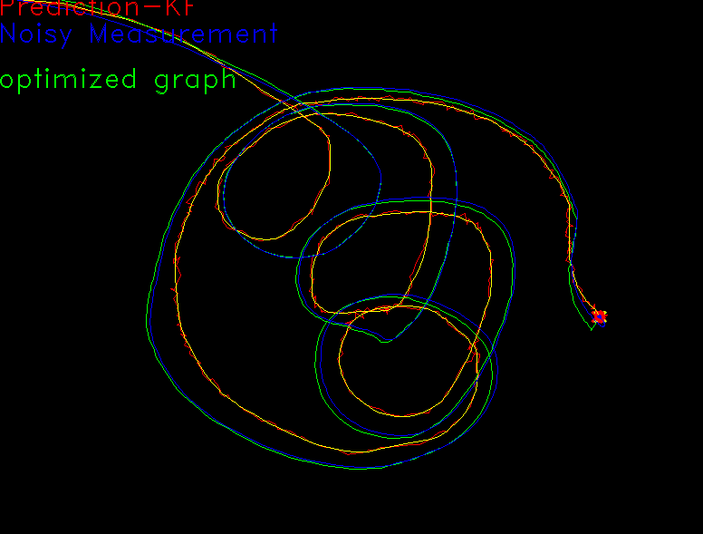

#Archived-project 
# Goal of this project
-  Study how to use docker set up a compile environment
- Study openCV Kalman Filter library.
-  Review Cmake setup for a C++ project
-  Study graph optimization libray g2o
- Study Lie algebra library Sophus
# How to use
move mouse to see the trajectory, Press g (lower case) to do the optimization.
# Overview
This is a small study project aim to practice opencv,g2o and some other packages that are common for SLAM. This program will  use Kalman Filter to generate a smooth trajectory given noisy measurement. By press a key, the program will also use g2o to generate an optimized trajectory based a simple optimization problem.
## Kalman Filter
define state
$$define\;x_k =  \begin{bmatrix} x  \\ y \\ dx \\ dy\end{bmatrix}$$
$$x_{k+1}= A*x_k + w_k$$
$w$ is Gaussian noise with covariance  R
Therefore $$A =  \begin{bmatrix} 1,0,1,0 \\ 0,0,0,1 \\ 0,0,1,0 \\ 0,0,0,1\end{bmatrix}$$
Measurement
$$define\;y =  \begin{bmatrix} x  \\ y \end{bmatrix}$$

$$y= C*x_{k+1} + v_k$$
$v$ is Gaussian noise with covariance Q,C is 2*2 Identity matrix
## g2o graph optimization
I set up a simple graph optimization problem to practice g2o. The goal is to apply a transformation matrix T(present as SE(2) use Sophus) on the trajectory Kalman filter generated  that satisfy the following constraint.  

$$\min_{T}\frac{1}{2}\sum^N_{i=1}||y_i - T*x_i||^2$$
I modeled T as vertices in g2o, and each edge is an error module defined above. 
This optimization actually doesn't have a really good result, as the module is very simple, but the goal is simply practice procedure on setting up a least square optimization problem with g2o. 
# Result

# Current Task
This project completed the given goal.
[[Mouse Detection Project task and resource]]
# Futurework
- Practice Thread in C++
-  
# Reference
[[Opencv Kalman filter]]
[[g2o usage]] [[g2o concept]] [[Kalman Filter]]